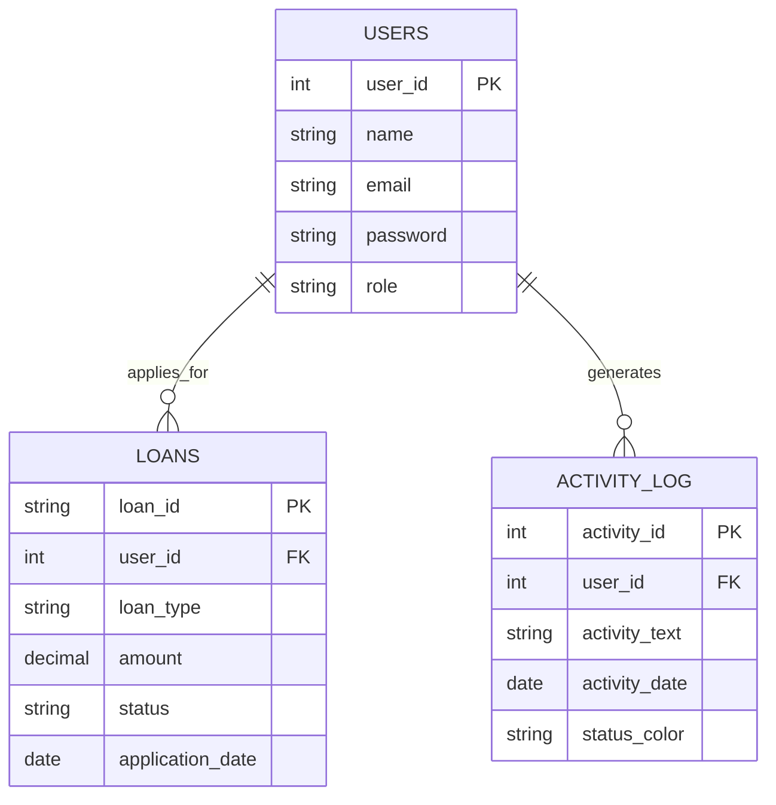

```mermaid
erDiagram
    USERS ||--o{ LOANS : applies_for
    USERS ||--o{ ACTIVITY_LOG : generates
    
    USERS {
        int user_id PK
        string name
        string email
        string password
        string role
    }
    
    LOANS {
        string loan_id PK
        int user_id FK
        string loan_type
        decimal amount
        string status
        date application_date
    }
    
    ACTIVITY_LOG {
        int activity_id PK
        int user_id FK
        string activity_text
        date activity_date
        string status_color
    }
```
